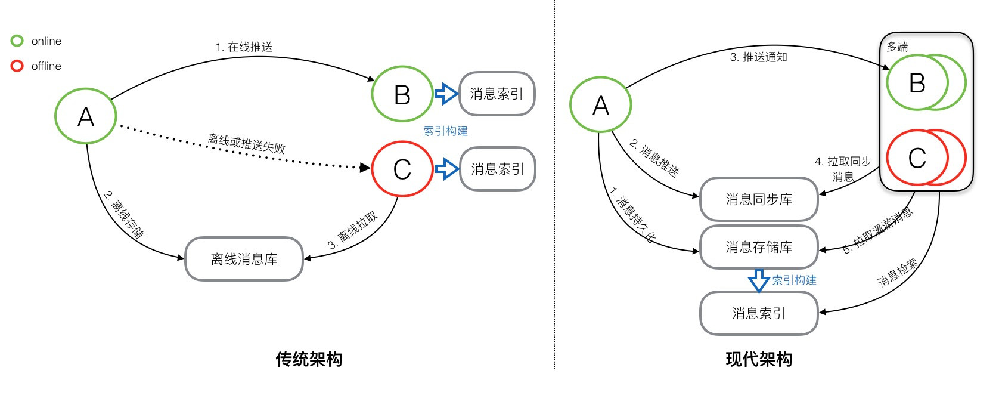

### 现代IM架构 

**IM核心:消息系统功能**

- 消息同步:消息传递的实时性, 完整性,支撑的消息规模;在线推送,离线推送, 多端同步;
- 消息存储:本地存储, 服务端存储(消息漫游)
- 消息检索:本地检索,在线存储检索

#### 消息系统的架构

> TPS(Transaction Per Second): 数据库测试,每秒事务处理量

**传统架构图和现代架构图**

**传统架构**

- 服务端:维护发送方和接收方连接状态, 离线消息未被接收存储到离线消息库,接收后从库中删除; 消息检索在本地进行;服务端不会持久化消息;无法支持消息漫游;

**现代架构**

-  消息存储库

  消息持久化, 先存在存储库,如果客户端接收到消息,那么消息一定在存储库中存储过, 新的同步设备消息漫游需求使用存储库实现;

- 消息同步库

  在线推送或者离线消息,客户端主动从服务端同步库拉取消息,所以服务端

  必须保存所有同步到接收方的消息;

- 消息索引

  在消息存储库上建立服务器端检索

#### 基础模型

- 