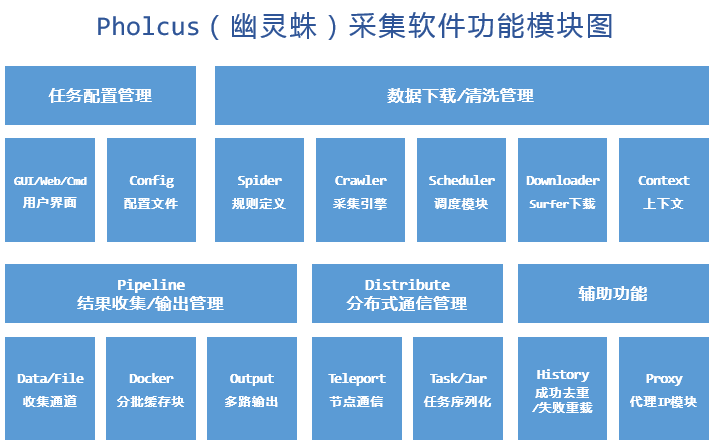

#### 模块图 

#### app目录

- aid : 辅助功能
  - history模块   成功去重/失败重载    
  - Proxy模块      代理IP模块
- crawler: 采集引擎
  - crwaler模块   采集引擎
- distribute: 分布式通信管理
  - task/jar          任务序列化
  - teleport         telport节点通信
- pipeline :结果收集/输出管理
  - data/file                   收集通道
  - docker                       分批缓存块
  - output                      多路输出(支持多种文件格式和数据库)
- 数据下载清洗管理
  - spider                        
    - 规则定义
    - context 上下文
  - crawler                      采集引擎
  - schedular                 调度模块
  - dowloader
    - 下载模块   , request请求

#### 任务配置器

- gui   程序运行界面
  - web
  - gui
  - cmd
- config 配置文件
  - 配置文件

#### common 目录

- 一些公用的包 mysql  mgo  bytes等

#### exec 目录

- 程序执行入口, 对应于不同的平台

#### logs目录

- 日志模块

#### pholcus_pkg 目录

- 暂时不清楚用法

#### runtime 目录

- 运行时模块

#### vender 目录

- 第三方库存放目录;import包先从此目录中找,没有从gopath下找

#### web目录

- web运行相关

