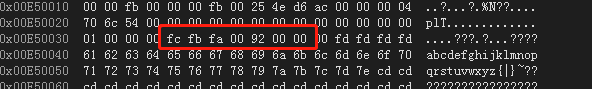

### 空指针问题


- 空指针问题
- malloc细节


2019.5.31 调试了两个半小时,教训深刻

```C++
int ChkOrderInfo_Nonoil(TranDataMem *pstTranDataMem, void *pvDbContext, ULONG *pulFlag)
{
    NetTran     *pstNetTran = NULL;
    TranData    *pstTranData    = NULL;
    PurchaseOrder *pstPurchaseOrder = NULL;
    //NonTran     *pstNonTran = NULL;
    NonTran     stNonTran;

    //memset(pstNonTran, 0x00, sizeof(NonTran));
    ....
 }
```

**上述代码注释中的问题**

- 给地址为NULL的空间初始化什么鬼???不崩溃才怪,把自己都写傻了;


#### 正确示例

```C++
#include <iostream>

struct MyStruct
{
    int a;
    char b;
};

int main()
{
    MyStruct *st = NULL;
    st = (MyStruct *)malloc(sizeof(MyStruct));
    memset(st, 0x00, sizeof(MyStruct));
    free(st); //内存泄漏这里产生
    st = NULL; //野指针在这里产生
    return 0;
}
```


### malloc细节

- free过后malloc的那一段数据是脏数据.

- 多数malloc/free实现不会把释放的内存返回给操作系统, 而是供同一程序的后续malloc使用

- 指针对象和指针变量:函数中局部指针变量在出函数作用域时候,如果调用malloc没有free掉, 虽然指针变量值被释放掉了,但是malloc的那一段内存还被占用着, 所以局部指针变量malloc后也需要释放

- 多个malloc分配地址空间是否连续问题:

  - 受内存对齐影响
  - malloc时候长度占用空间也会影响

- free怎么知道释放多大空间(vs2015测试)

  - vs2015测试申请地址前12字节处记录释放空间大小
  - Linux里面glibc在分配内存的时候会在内存块的地址前面的4个字节出存放内存块的大小(**未测试**)

  ```C++
  	char *p = NULL;
      p = (char *)malloc(sizeof(char) * 0xfafbfc);
      for (char i = 0; i < 10; i++)
      {
          *(p+i) = 'a' + i;
      }
      free(p);
      p = NULL;
     
  ```

  

  


struct MyStruct1
{
    short c;
    int a;
    char b;
    double d;
};

struct MyStruct
{
    short c;
    double a[5] ;
    char b;
    MyStruct1 m;
};


结构体大小: