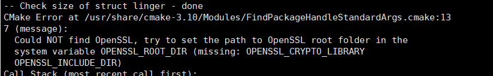

### libevent  Ubuntu make报错


**排错过程：**

- 安装autoconf， 无用

- 网上查找报错 recipe for target 'Makefile.in' failed 可能是makefile文件编码问题， 将Makefile.in复制到windows用notepad更改编码位ascii， 运行成功


**深层原因**

- 排除下ubuntu下编码


### cmake后无bin目录




- ```
  sudo apt-get install libssl-dev
  ```

> > >  **安装libssl后重新执行cmake .**
> > >
> > > 奇怪的是， 重新cmake后， 执行make不会报错， 说明上面的问题不是编码问题？？？？而是cmake没有生成指定平台的Makefile
> > >
> > > > 

