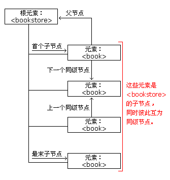

#### 目录

- XMLDOM 节点
- 节点属性
- 

### XMLDOM节点（XML每个成分都是一个节点）

1. 整个文档是一个文档节点
2. 每个XML元素是一个元素节点
3. 元素包裹的文本是一个文本节点
4. 元素属性是属性节点
5. 注释是注释节点

**节点图*

### 节点属性

1. nodeName 

   - 节点名称只读
   - 元素节点名称为元素名称，
   -  属性节点名称为属性名， 
   - 文本节点名称为#text， 
   - 文档节点名称为#document

2. nodeValue

   - 元素节点的值是未定义的
   - 文本节点值是文本本身
   - 属性节点值是属性的值

3. nodeType

   - 节点类型只读

     | 元素类型 | 节点类型 |
     | -------- | -------- |
     | 元素     | 1        |
     | 属性     | 2        |
     | 文本     | 3        |
     | 注释     | 8        |
     | 文档     | 9        |

     